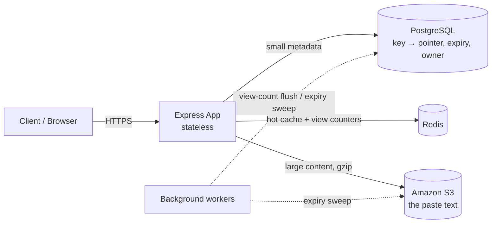
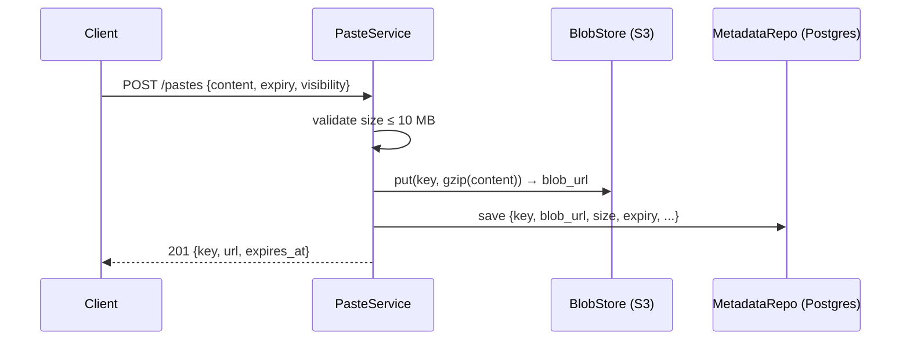

# 📋 Pastebin

A production-style **pastebin** — share text, code, or logs and get a short URL back —
built to demonstrate the one idea that defines the problem: the **metadata / blob split**.

> **Small structured data → database. Large unstructured blobs → object storage. The
> database stores only a pointer.**

Paste metadata (key, size, expiry, visibility, owner, views) lives in **PostgreSQL**; the
paste content itself is gzip-compressed and stored in **Amazon S3**. Hot reads are served
through **Redis**. The whole thing runs on **AWS** behind free HTTPS, with a one-command
redeploy pipeline.

**Stack:** TypeScript · Node/Express · PostgreSQL (Prisma) · Redis · Amazon S3 · Docker · AWS (EC2, ECR, IAM, SSM)

---

## Architecture



**Why the split?** A paste can be megabytes of text — too big and too cheap-to-store to
sit in a DB row. Object storage is built for large blobs (cheap, 11-nines durable,
CDN-frontable); the database keeps a tiny, queryable row with a `blob_url` pointer. The
code encodes this directly: `PasteService` writes the **blob first**, then the metadata,
so a failed write never leaves metadata pointing at a missing blob.

### Write path


---

## Features

| # | Feature | Notes |
|---|---------|-------|
| F1/F2 | Create & read pastes | JSON API, rendered HTML view, and a `/raw` view for `curl` |
| F3 | Unguessable keys | random Base62, not sequential |
| F4 | Size cap | 10 MB → `413 Payload Too Large` (enforced on raw bytes) |
| F5 | Expiry | `never · 10m · 1h · 1d · 1w · burn` — burn-after-read → `410 Gone`; lazy purge **plus** a background sweep |
| F6 | Visibility | `public · unlisted · private` (private enforced server-side → `403`) |
| F7 | Custom alias | `409 Conflict` if taken |
| F8 | Language hint | stored for client-side syntax highlighting |
| F9 | List my pastes | `GET /api/v1/users/me/pastes` |

**Also:** Redis-backed hot cache (metadata + small blobs) and **view counters buffered in
Redis then batch-flushed to Postgres** — so reads don't hit the DB with a write each time.
A fixed-window **rate limiter** guards the create endpoint. Redis is entirely optional —
if it's down, the app degrades gracefully to Postgres + the blob store.

The landing page is a clean, responsive UI with a light/dark theme toggle, a live
byte-counter, and copy-to-clipboard results.

---

## API

| Method | Path | Purpose |
|--------|------|---------|
| `POST` | `/api/v1/pastes` | create → `201 { key, url, expires_at }` |
| `GET` | `/api/v1/pastes/{key}` | read as JSON (with content) |
| `GET` | `/{key}` | rendered HTML view |
| `GET` | `/{key}/raw` | raw `text/plain` |
| `DELETE` | `/api/v1/pastes/{key}` | delete (owner only) → `204` |
| `GET` | `/api/v1/users/me/pastes` | list my pastes (auth) |
| `GET` | `/health` | health check |

Auth is intentionally simple for this study project: send `Authorization: Bearer <owner-id>`
— the token is treated as the owner id so ownership/visibility can be exercised end-to-end.

---

## Run it locally

```bash
npm install
cp .env.example .env

docker compose up -d          # Postgres + Redis
npm run db:push               # create the schema
npm run dev                   # hot-reload dev server → http://localhost:3000
```

Locally the blob store is a `LocalFileBlobStore` that writes gzip files to `./data/blobs`
— no S3 needed. Set `BLOB_BACKEND=s3` (+ `S3_BUCKET`) to use S3 instead, with **zero
code changes** (that's the point of coding to the `BlobStore` interface).

### Smoke test
```bash
curl -s -X POST http://localhost:3000/api/v1/pastes \
  -H 'content-type: application/json' \
  -d '{"content":"hello world","language":"text","expiry":"1h"}'
# → {"key":"aB3xK9","url":"http://localhost:3000/aB3xK9","expires_at":"..."}

curl -s http://localhost:3000/aB3xK9/raw     # hello world
```

### Tests
```bash
docker compose up -d postgres
npm run db:push
npm test        # Vitest integration tests
```
The suite hits a real Postgres + the blob store and covers the split, every status code
(`201/400/403/404/409/410/413`), burn-after-read, expiry, ownership, and listing.

---

## Deployment (AWS)

Runs as a single always-on EC2 instance (Docker Compose: app + Postgres + Redis +
[Cloudflare Tunnel](https://developers.cloudflare.com/cloudflare-one/connections/connect-networks/)
for free HTTPS), with **content in S3** and the image pulled from **ECR**.

```
        ┌──────────── EC2 (t3.small, Amazon Linux 2023) ────────────┐
Client → cloudflared → Express app ── metadata ──▶ Postgres (container)
 (HTTPS)  (tunnel)         │        ── cache ──────▶ Redis (container)
                           └── content ───────────▶ Amazon S3 (blobs)
                                                     ▲ creds via EC2 IAM role (IMDSv2)
```

Highlights of the setup:
- **Least-privilege IAM** — a dedicated instance role with ECR-read, SSM, and a
  bucket-scoped S3 policy. No credentials in code; the app reads them from IMDSv2.
- **No inbound ports / no SSH** — cloudflared is outbound-only; management is done over
  **AWS SSM**.
- **One-command redeploy** — `deploy/aws-ec2/redeploy.sh` builds & pushes the image, then
  drives the running box over SSM to pull + restart, and republishes the live URL to S3.
- **Self-healing storage story** — S3 lifecycle rule backstops expiry cleanup; blob
  content is durable independent of the instance.

See [`deploy/aws-ec2/README.md`](deploy/aws-ec2/README.md) for the full launch / redeploy /
teardown guide, plus `relaunch.ps1` for a fresh-launch from Windows.

---

## Project structure

```
src/
  app.ts            Express wiring + error→HTTP-status mapping
  index.ts          listener, graceful shutdown, background workers
  config.ts         env-driven config
  db.ts             Prisma client (metadata store)
  blobstore.ts      BlobStore interface + LocalFileBlobStore + S3BlobStore
  cache.ts          Redis: metadata cache, small-blob cache, view counters
  pasteService.ts   orchestration — the metadata/blob split lives here
  keygen.ts         random Base62 keys
  expiry.ts         expiry option → expiresAt / burn-after-read
  validation.ts     zod request schemas
  rateLimit.ts      fixed-window rate limiter
  auth.ts           bearer-token → owner id
  viewFlusher.ts    batch-flush Redis view counters → Postgres
  cleanupWorker.ts  periodic expiry sweep
  errors.ts         domain errors carrying an HTTP status
  routes/           pastes · users · view (raw/html) · home
prisma/schema.prisma   metadata schema (content is never stored here)
deploy/aws-ec2/        Docker Compose, user-data, deploy/redeploy/relaunch scripts
tests/                 Vitest integration tests
```

---

## Engineering decisions worth calling out

- **Code to an interface, not a vendor.** `PasteService` depends on the `BlobStore`
  interface, so local-disk (dev) and S3 (prod) are a one-line wiring choice — Dependency
  Inversion in practice.
- **Keep writes off the read path.** View counts increment a Redis counter and a worker
  flushes them to Postgres in batches, instead of a DB write per view.
- **Blob-first ordering.** Writing the blob before the metadata means the DB never points
  at a missing object; orphaned blobs are cheap and swept later.
- **Fail open, not closed.** If Redis is unavailable, caching and rate limiting degrade
  gracefully rather than taking the service down.
- **A real-world AWS gotcha:** the app runs in a container, one network hop from the
  metadata service, so the instance needs **IMDSv2 hop-limit 2** for the AWS SDK to fetch
  S3 credentials — a subtle but critical detail.

---

## License

MIT. Built as a system-design study track (following a URL shortener),
by Shubhanjali.
